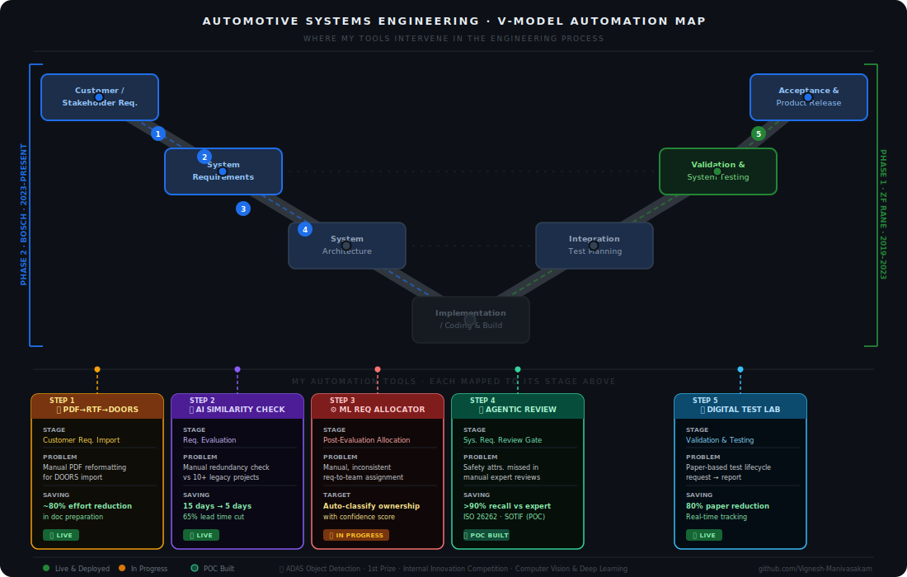

<h1 align="center">👋 Hi, I'm Vignesh Manivasakam</h1>

<h3 align="center">R&D Digitalization Engineer &nbsp;·&nbsp; Automotive AI &nbsp;·&nbsp; Systems Engineering Automation</h3>

  
  

---

## 🎯 What I'm Building

> **I'm a Systems Engineer who speaks both languages — automotive engineering standards and modern AI. I build tools that sit inside the V-model and eliminate the manual work that slows R&D teams down at every stage.**

6+ years in automotive systems (EPS, Steer-by-Wire) gave me a clear view of where engineers lose the most time — not in the hard thinking, but in the repetitive, manual, error-prone steps surrounding it. So I started building AI tools to fix those gaps, one workflow stage at a time.

Every project on this GitHub targets a specific bottleneck in the engineering process. Together, they form a pipeline.

---

## 🗺️ The Big Picture — Automating the V-Model

  

> **Left side (Phase 2 · Current @ Bosch):** A connected 4-step AI pipeline automating the requirements engineering workflow — from customer input through to safety-reviewed, allocated system requirements.
>
> **Right side (Phase 1 · Past @ ZF Rane):** End-to-end digitalization of the test & validation lifecycle — from DVP planning through execution to report generation.

---

## 📦 Project Portfolio

### ⬅️ Phase 2 — Requirements Engineering Automation *(Bosch · 2023–Present)*

---

#### 📥 Step 1 · PDF → RTF → DOORS Import Converter
> *"The tool nobody talks about — but every requirements engineer desperately needs."*

| | |
|---|---|
| **Problem** | Importing customer requirement PDFs into IBM DOORS required manual reformatting — repetitive, error-prone, and consuming hours per project |
| **Solution** | Automated pipeline: parse PDF structure → generate DOORS-compatible RTF → import ready, with Human in loop |
| **Impact** | Document preparation effort reduced by **~70%** across the requirements team |
| **Tech** | `Python` `PDF Parsing` `RTF Generation` `DOORS Integration` |
| **Status** | ✅ Deployed internally · Confidential tool not available in Public|

---

#### 🔍 Step 2 · AI Requirement Similarity Assistant
> *"Stop re-inventing requirements that already exist in your legacy projects."*

| | |
|---|---|
| **Problem** | Engineers manually compared incoming requirements against 10+ legacy projects — taking up to 15 days per cycle with no consistency |
| **Solution** | RAG pipeline that ingests PDF/Excel requirement files, generates embeddings, and surfaces semantically similar requirements from predecessor projects |
| **Key Innovation** | Exact-Match Filter *before* semantic search — reducing API token usage by 40% |
| **Impact** | Review cycle cut from **15 days → 5 days (~65% lead time reduction)** |
| **Tech** | `Python` `Azure OpenAI GPT-4` `FAISS` `Streamlit` |
| **Status** | ✅ Deployed internally · 🔗 Public POC on this GitHub |

---

#### ⚙️ Step 3 · ML-Based Requirement Allocator *(In Progress)*
> *"Once you know a requirement is valid — who should own it?"*

| | |
|---|---|
| **Problem** | Allocating requirements to the correct system component or team is a manual, expert-dependent decision — inconsistent across projects and OEMs |
| **Solution** | NLP classification model trained on historical allocation decisions to predict ownership with a confidence score |
| **Tech** | `Python` `NLP` `Scikit-learn` `Transformers``deep learning` `LLM` |
| **Status** | 🔄 In Progress — Model training ongoing |

---

#### 🛡️ Step 4 · Agentic Multi-Domain Requirement Reviewer *(POC)*
> *"What if a safety expert, a test engineer, and a domain architect reviewed every requirement simultaneously — before a human even saw it?"*

| | |
|---|---|
| **Problem** | Manual reviews missed tooks more time in the development cycle |
| **Solution** | Multi-agent system with specialized personas: Safety & Security Agent (ISO 26262 / SOTIF), Test Verifiability Agent, and a Data Layer agent for input collection and refinement |
| **Impact** | **>90% recall** identifying missing safety attributes vs. manual domain-expert review |
| **Tech** | `Python` `Multi-Agent Systems` `Prompt Engineering` `LLMs``Langraph` |
| **Status** | 🔬 POC Built · Validated against domain expert benchmark |

---

### ➡️ Phase 1 — Test & Validation Automation *(ZF Rane · 2019–2023)*

---

#### 📊 Step 5 · Digital Test Lab Management System
> *"From paper-based chaos to real-time digital test operations."*

| | |
|---|---|
| **Problem** | The full test lifecycle — request, scheduling, execution, reporting — ran on paper and spreadsheets, causing delays, data loss, and zero visibility |
| **Solution** | End-to-end digital system: Request → Scheduling → Execution Tracking → Report Generation |
| **Role** | Project Lead & Process Architect — defined business logic and system architecture, managed external development team |
| **Impact** | Paper-based processes reduced by **80%** · Real-time equipment utilization tracking enabled across the test organization |
| **Tech** | `Buisness process` `Process Design` `dotnet` `Data Management` |
| **Status** | ✅ Deployed & live in production |

---

## 🏆 Beyond the Pipeline — Domain Exploration

#### 🚗 ADAS Object Detection for Indian Road Scenarios
> *Proving that automotive AI goes beyond NLP — into real-time perception.*

- Built an object detection model tuned specifically for **Indian road conditions** — a harder problem than standard datasets due to mixed traffic, occlusion, and diverse road types
- Addressed class imbalance, varied lighting, and urban/rural edge cases from the ground up
- **🥇 Won 1st Prize** at an internal innovation competition
- **Tech:** `Python` `Computer Vision` `Object Detection` `Deep Learning`

---

## 🛠️ Tech Stack at a Glance

---

## 📈 What's Next

- **Complete the ML Allocator** — close the gap between import and review stages
- **Right-side AI expansion** — automated test data analysis and AI-assisted DVP generation
- **Pipeline integration** — connecting individual tools into a unified, end-to-end requirements workflow

---

## 🤝 Let's Connect

I'm actively exploring roles in **R&D Digitalization**, **Automotive AI**, and **Systems Engineering Automation**.

