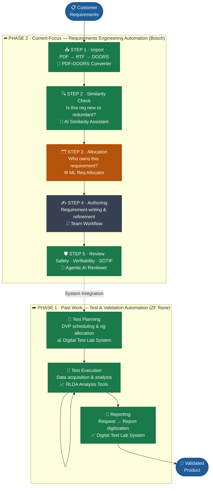

<h1 align="center">👋 Hi, I'm Vignesh Manivasakam</h1>

<h3 align="center">R&D Digitalization Engineer · Automotive AI · Systems Engineering Automation</h3>

  
  
  

---

## 🎯 What I'm Building

> **I automate the manual cognitive bottlenecks in automotive R&D workflows — using RAG pipelines, Agentic AI, and ML — so engineers can focus on engineering.**

I'm a Systems Engineer with 6+ years in automotive (EPS, Steer-by-Wire) who got frustrated watching skilled engineers spend weeks on tasks that AI can handle in hours. So I started building tools to fix that — one workflow stage at a time.

This GitHub is that body of work.

---

## 🗺️ The Big Picture — Automating the V-Model

Every project here maps to a real stage in the automotive systems engineering V-model. This isn't a collection of side projects — it's a **systematic attempt to build an AI layer on top of the engineering process.**

**Legend:**  🟢 Built & Live &nbsp;|&nbsp; 🟠 In Progress &nbsp;|&nbsp; ⚫ Team Ownership

---

## 📦 Project Portfolio

### ⬅️ Phase 2 — Requirements Engineering Automation

---

#### 🤖 AI Requirement Similarity Assistant
> *"Stop re-inventing requirements that already exist in your legacy projects."*

| | |
|---|---|
| **Problem** | Engineers manually compared new customer requirements against 10+ legacy projects — taking up to 15 days per review cycle |
| **Solution** | RAG pipeline that ingests PDF/Excel requirement files, generates embeddings, and surfaces semantically similar requirements from predecessor projects |
| **Key Innovation** | Built an Exact-Match Filter *before* semantic search — reducing API token usage by 40% |
| **Impact** | Review cycle cut from **15 days → 5 days (~65% reduction)** |
| **Tech** | `Python` `Azure OpenAI GPT-4` `LangChain` `FAISS` `Streamlit` |
| **Status** | ✅ Deployed internally · 🔗 Public POC available |

---

#### 🛡️ Agentic AI System Requirement Reviewer
> *"What if a safety expert reviewed every requirement before a human even saw it?"*

| | |
|---|---|
| **Problem** | Manual requirement reviews missed safety attributes, creating compliance gaps discovered late in the development cycle |
| **Solution** | Multi-agent system with specialized roles: Safety & Security Agent (ISO 26262 / SOTIF), Verifiability Agent, and a Data Layer for input refinement |
| **Impact** | **>90% recall** in identifying missing safety attributes vs. manual domain expert review |
| **Tech** | `Python` `Multi-Agent Systems` `Prompt Engineering` `LLMs` |
| **Status** | ✅ Built · Results validated against domain expert benchmark |

---

#### ⚙️ ML-Based Requirement Allocator *(In Progress)*
> *"Given a requirement, which system component or team should own it?"*

| | |
|---|---|
| **Problem** | Allocating customer requirements to the correct system/team is a manual, expert-dependent decision prone to inconsistency across projects |
| **Solution** | NLP classification model trained on historical allocation decisions to predict ownership with confidence scoring |
| **Approach** | Feature engineering on requirement text + metadata → classification pipeline with explainability layer |
| **Tech** | `Python` `NLP` `Scikit-learn` `Transformers` |
| **Status** | 🔄 In Progress — model training ongoing |

---

#### 📥 PDF → RTF → DOORS Import Converter
> *"The tool nobody talks about — but everyone needs."*

| | |
|---|---|
| **Problem** | Importing customer requirement PDFs into IBM DOORS required manual reformatting — a repetitive, error-prone process eating hours per project |
| **Solution** | Automated conversion pipeline: parse PDF structure → generate DOORS-compatible RTF → direct import ready |
| **Impact** | Reduced document preparation effort by **~80%** across the requirements team |
| **Tech** | `Python` `PDF Parsing` `RTF Generation` `DOORS Integration` |
| **Status** | ✅ Deployed internally · Sanitized version coming to GitHub |

---

### ➡️ Phase 1 — Test & Validation Automation *(ZF Rane)*

---

#### 📊 Digital Test Lab Management System
> *"From paper-based chaos to real-time digital test operations."*

| | |
|---|---|
| **Problem** | The entire test lifecycle — request, scheduling, execution, reporting — ran on paper and spreadsheets, causing delays and data loss |
| **Solution** | End-to-end digital system covering the full workflow: Request → Scheduling → Execution Tracking → Report Generation |
| **Role** | Project Lead & Process Architect — defined business logic, managed external dev team |
| **Impact** | Reduced paper-based processes by **80%** · Enabled real-time equipment utilization tracking |
| **Tech** | `System Architecture` `Process Design` `VBA` `Data Management` |
| **Status** | ✅ Deployed & live in production |

---

## 🏆 Beyond the Pipeline — Domain Exploration

#### 🚗 ADAS Object Detection for Indian Road Scenarios
> *Proving that automotive AI goes beyond NLP and text — into real-time perception.*

- Built an object detection model specifically trained and tuned for **Indian road conditions** — a significantly harder problem than standard Western road datasets due to road diversity, mixed traffic, and edge cases
- Tackled data challenges: class imbalance, occlusion, varied lighting across urban/rural scenarios
- **🥇 Won 1st Prize** at an internal innovation competition
- **Tech:** `Python` `Computer Vision` `Object Detection` `Deep Learning`

---

## 🛠️ Tech Stack

---

## 📈 What's Next

The V-model pipeline is taking shape on both sides. The natural next frontier:

- **Complete the ML Allocator** — close the gap between import and review
- **Right-side AI expansion** — applying AI to test data analysis and automated DVP generation
- **Pipeline integration** — connecting the individual tools into a unified requirements workflow

---

## 🤝 Let's Connect

I'm actively exploring roles in **R&D Digitalization**, **Automotive AI**, and **Systems Engineering Automation** — in India and Europe.

If you're working on similar problems, or hiring for teams that are — let's talk.

