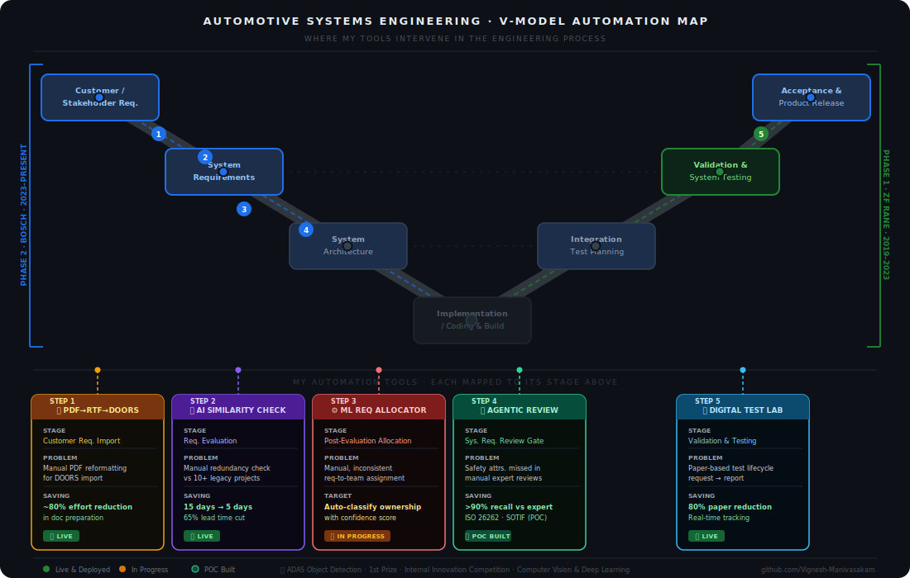

<h1 align="center">👋 Hi, I'm Vignesh Manivasakam</h1>

<h3 align="center">R&D Digitalization Engineer &nbsp;·&nbsp; Automotive AI &nbsp;·&nbsp; GenAI & Agentic Systems</h3>

  
  
  

---

## ⚡ TL;DR — What I Do

> **6+ years in automotive systems engineering (EPS, Steer-by-Wire) × AI/ML — I build production-grade AI tools that eliminate manual bottlenecks inside the automotive V-Model.**
> Currently automating Requirements Engineering @ Bosch. Previously digitalized the full Test & Validation lifecycle @ ZF Rane.

---

## 🏆 Impact at a Glance

| Metric | Result |
|---|---|
| ⏱️ Lead time reduction (Requirement Reviews) | **15 days → 5 days (65% cut)** |
| 💰 Cost avoidance across 3 global OEM programs | **$8,880 USD + 280 engineering hours saved** |
| ♻️ NFR reusability improvement (10+ projects) | **>80% increase** |
| 📄 Paper-based process reduction | **80% paperless** |
| 🛡️ Safety attribute recall vs. manual expert review | **>90%** |
| 🥇 ADAS Hackathon | **1st Prize — YOLOv8 on Indian Roads** |

---

## 🗺️ The Big Picture — Automating the Automotive V-Model

  

| Phase | Company | Period | Focus |
|---|---|---|---|
| **Phase 2 (Current)** | Bosch | 2023–Present | Requirements Engineering Automation |
| **Phase 1** | ZF Rane | 2019–2023 | Test & Validation Digitalization |

---

## 📦 Project Portfolio

### ⬅️ Phase 2 — Requirements Engineering @ Bosch

---

#### 📥 Step 1 · PDF → RTF → DOORS Import Converter

> *"The tool nobody talks about — but every requirements engineer desperately needs."*

| | |
|---|---|
| **Problem** | Importing customer PDFs into IBM DOORS required manual reformatting — hours of error-prone work per project |
| **Solution** | Automated pipeline: PDF parse → DOORS-compatible RTF → human-in-loop import |
| **Impact** | **~70% reduction** in document preparation effort |
| **Tech** | `Python` `PDF Parsing` `RTF Generation` `IBM DOORS` |
| **Status** |  Confidential — metrics shared |

---

#### 🔍 Step 2 · AI Requirement Similarity Assistant

> *"Stop re-inventing requirements that already exist in your legacy projects."*

| | |
|---|---|
| **Problem** | Engineers manually compared incoming requirements against 10+ legacy projects — up to 15 days per cycle, zero consistency |
| **Solution** | RAG pipeline ingesting PDF/Excel files, with an **Exact-Match Filter before semantic search** (cutting API token usage by 40%) |
| **Impact** | **65% lead-time cut** · **$8,880 cost avoidance** · **280 engineering hours saved** across 3 OEM programs |
| **Tech** | `Python` `Azure OpenAI GPT-4` `RAG` `FAISS` `Streamlit` |
| **Status** |  Deployed internally · 🔗 [Public POC](https://github.com/Vignesh-Manivasakam/Requirement-Similarity-Assistant-POC) |

---

#### ⚙️ Step 3 · ML-Based Requirement Allocator *(In Progress)*

> *"Once you know a requirement is valid — who should own it?"*

| | |
|---|---|
| **Problem** | Requirement-to-component allocation is a manual, expert-dependent decision — inconsistent across projects and OEMs |
| **Solution** | NLP classifier trained on historical allocation data to predict ownership with a confidence score |
| **Tech** | `Python` `NLP` `Scikit-learn` `Transformers` `LLMs` |
| **Status** |  Model training ongoing |

---

#### 🛡️ Step 4 · Agentic Multi-Domain Requirement Reviewer *(POC)*

> *"Safety expert + Test engineer + Architect — reviewing every requirement simultaneously, before a human sees it."*

| | |
|---|---|
| **Problem** | Manual reviews missed safety attributes and consumed significant time in the development cycle |
| **Solution** | Multi-agent system: Safety & Security Agent (ISO 26262) + Test Verifiability Agent + Data Layer orchestration |
| **Impact** | **>90% recall** on missing safety attributes vs. domain-expert manual review |
| **Tech** | `Python` `LangGraph` `Multi-Agent Systems` `Prompt Engineering` `LLMs` |
| **Status** |  Validated against domain-expert benchmark |

---

### ➡️ Phase 1 — Test & Validation @ ZF Rane

---

#### 📊 Step 5 · Digital Test Lab Management System

> *"From paper-based chaos to real-time digital test operations."*

| | |
|---|---|
| **Problem** | The entire test lifecycle — request, scheduling, execution, reporting — ran on paper and spreadsheets |
| **Solution** | End-to-end system: Request → Scheduling → Execution Tracking → Automated Report Generation |
| **Role** | **Project Lead & Process Architect** — defined business logic, system architecture, managed external dev team |
| **Impact** | **80% paperless** · Real-time equipment utilization tracking across the test organization |
| **Tech** | `Process Design` `.NET` `Data Management` |
| **Status** |  Deployed in production |

---

## 🏅 Beyond the Pipeline

#### 🚗 ADAS Object Detection for Indian Road Scenarios

- YOLOv8m trained on IDD dataset with progressive resolution + heavy weather augmentation
- **mAP@50-95: 0.420 · Precision: 0.773 · Recall: 0.569**
- Addressed class imbalance, occlusion, and mixed urban/rural traffic — uniquely hard vs. standard benchmarks
- **🥇 1st Prize** — Internal ADAS Innovation Hackathon
- 🔗 [Full Repository](https://github.com/Vignesh-Manivasakam/ADAS-Object-Detection-Indian-Roads)

---

## 🛠️ Tech Stack

  
  
  
  
  
  
  
  
  
  
  
  

---

## 📈 What's Next

- 🔄 Complete the **ML Requirement Allocator** — close the gap between import and review stages
- 🔬 Expand **right-side AI** — automated test data analysis & AI-assisted DVP generation
- 🔗 **Pipeline integration** — connecting all tools into a unified, end-to-end requirements workflow

---

## 🤝 Let's Connect

**Actively seeking roles in R&D Digitalization · GenAI Systems Engineering · Automotive AI** *(open to relocation)*

If you're building next-gen automotive R&D platforms — let's talk.

  

Built with ❤️ for safer, faster, and smarter automotive engineering

