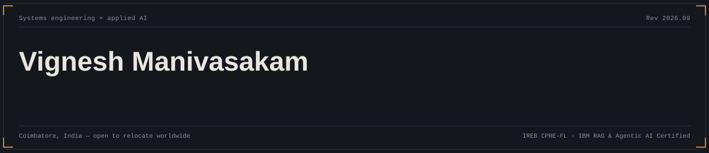
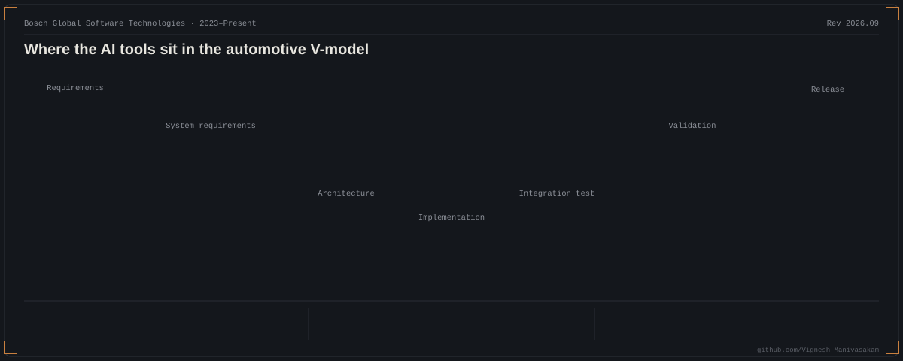

  <picture>
    <source media="(prefers-color-scheme: dark)" srcset="./assets/hero-dark.svg">
    <source media="(prefers-color-scheme: light)" srcset="./assets/hero-light.svg">
    
  </picture>

  
  
  

---

## ⚡ TL;DR — What I do

> **7+ years bridging safety-critical automotive systems engineering (EPS, Steer-by-Wire, ISO 26262, ASPICE) with production AI automation.**
> Built and deployed enterprise AI platforms at Bosch Global Software Technologies, delivering **$86,719 USD in verified cost avoidance** and **2,760+ engineering hours saved** across 10–15 European and North American OEM vehicle programs. Previously digitalized the full test & validation lifecycle at ZF Rane.

---

## 📊 Measured engineering impact

  <picture>
    <source media="(prefers-color-scheme: dark)" srcset="./assets/flow-dark.svg">
    <source media="(prefers-color-scheme: light)" srcset="./assets/flow-light.svg">
    
  </picture>

| Metric | Result |
|---|---|
| ⏱️ Requirement review lead time | **15 days → 5 days (65% cut)** |
| 📄 ReqIF ingestion lead time | **15 days → ~3 days (80% cut)** across 6,000+ pages |
| 💰 Total verified cost avoidance (10–15 OEM programs) | **$86,719 USD + 2,760+ engineering hours saved** |
| 🛡️ Safety attribute recall vs. certified functional-safety experts | **>90% recall · 60% faster review** |
| ♻️ NFR specification reusability (10+ platforms) | **>80% reuse · 40% less baseline-authoring effort** |
| 📋 ASPICE / IATF 16949 audit pass rate | **100%** across customer OEM inspections |
| 🧑‍🏫 Engineering mentorship | **25+ systems & validation engineers** mentored |
| 🥇 ADAS hackathon | **1st Prize** — YOLOv8 on Indian roads |

---

## 🗺️ The big picture

| Phase | Company | Period | Focus |
|---|---|---|---|
| **Phase 2 (Current)** | Bosch Global Software Technologies | 2023–Present | Requirements Engineering Automation |
| **Phase 1** | ZF Rane Automotive India | 2019–2023 | Test & Validation Digitalization |

---

## 📦 Project portfolio

### Phase 2 — Requirements engineering @ Bosch

---

#### 📥 PRISM — Automated ReqIF Ingestion Engine

> *"The tool nobody talks about — but every requirements engineer desperately needs."*

| | |
|---|---|
| **Problem** | Importing customer specification PDFs into IBM DOORS required up to **15 days** of manual reformatting per project — error-prone, repetitive, and blocking every downstream activity |
| **Solution** | Enterprise document transformation pipeline built on **Azure Document Intelligence**, with a dual-path extractor alongside **PaddleOCR-VL** → interactive React canvas block editor → concurrent export to three DOORS-compatible formats (**RTF with OLE**, **HTML**, **ReqIF XML**) |
| **Key engineering** | • **ReqIF 1.2 compliance** — full OMG spec with multi-tool targeting (DOORS Classic 9.x, DOORS Next/ELM, Polarion, Elektrobit) · • **Two-tier automatic ReqID discovery** — structural fingerprinting + frequency scoring, with meta-pattern regex fallback · • **Three-tier heading inference** — model → regex numbering → bbox height heuristic · • **OLE COM pooling manager** — process recycling to eliminate GDI handle leaks · • **OCR result caching** — immutable/mutable JSON split avoids re-running GPU inference on revisits · • **Language filter** — auto-discards non-English blocks from mixed content |
| **Impact** | **15 days → ~3 days (80% cut)** · **6,000+ pages processed** · **$30,163 USD cost avoidance** |
| **Tech** | `Azure Document Intelligence` `PaddleOCR-VL` `FastAPI` `React/Vite/TypeScript` `ReqIF 1.2` `Word COM (OLE)` `Zustand` |
| **Status** |  · 🏛️ **[Enterprise Architecture Showcase]** |

---

#### 🔍 AI Requirement Similarity Assistant

> *"Stop re-inventing requirements that already exist in your legacy projects."*

| | |
|---|---|
| **Problem** | Engineers manually compared incoming customer requirements against 10+ legacy project specifications — up to 15 days per review cycle, zero consistency |
| **Solution** | ChromaDB-backed semantic search adopted across 10–15 European and North American OEM vehicle programs (Steer-by-Wire, EPS, Braking), built around a **dual-path token saver**: exact-string bypass at $0 LLM cost + embedding search for the rest — cutting API costs 40% |
| **Key engineering** | • **5-Gate self-improving prompt compiler** — (1) statistical error pattern analysis on aggregated feedback, (2) LLM-designed prompt patch, (3) 4-check automated validation (stat backing, contradiction detection, shadow test on holdout set, confidence threshold), (4) human review, (5) canary deployment with deterministic 10% session routing and auto-promote/rollback · • **Level 1 learning** — feedback recall skips the LLM for previously-reviewed pairs (cosine ≥ 0.97) · • **Per-user skill learning** — extracts matching preferences from corrections, persists in SQLite, injects top-10 rules into the prompt |
| **Impact** | **15 days → 5 days (65% cut)** · **$56,556 USD cost avoidance** · **1,800+ engineering hours saved** |
| **Tech** | `ChromaDB` `NVIDIA NIM` `FAISS` `Streamlit` `OpenAI SDK` `Tenacity` |
| **Status** |  Deployed internally · 🔗 [Public POC](https://github.com/Vignesh-Manivasakam/sentence-similarity-tool) |

---

#### 🛡️ Agentic Safety Review Graph

> *"Catch what a rushed manual review misses — before it reaches the vehicle."*

| | |
|---|---|
| **Problem** | Verifying safety-critical requirement attributes against ISO 26262 and SOTIF relied entirely on manual expert review — slow, and inconsistent under deadline pressure |
| **Solution** | LangGraph multi-agent compliance verification graph combining specialized agents — Safety Standard Parser, ASIL Decomposition Auditor, Requirement Verifiability Checker, Safety Critic — with evaluator-optimizer loops |
| **Impact** | **>90% recall** on safety-critical attributes, validated against certified functional safety experts · **60% faster** review cycle |
| **Tech** | `LangGraph` `ISO 26262` `ISO 21448 (SOTIF)` `Multi-Agent Evaluator-Optimizer` |
| **Status** |  — internal specification, not yet released as a standalone repo |

---

#### 🧠 Lumina RAG — Multimodal agentic enterprise search

> *"Ask your engineering documents anything — text, tables, drawings, audio, video."*

| | |
|---|---|
| **Problem** | Engineers had no unified way to query across heterogeneous document types (PDFs, drawings, audio meeting notes, video recordings) to verify functional safety requirements |
| **Solution** | Corrective RAG (CRAG) pipeline orchestrated by LangGraph with 5 agents — Router → Retriever → Grader → Rewriter → Generator. Self-correcting loops rewrite and re-retrieve (HyDE, step-back, decomposition) whenever retrieved context is irrelevant |
| **Key engineering** | • **Multimodal ingestion** — PDF/DOCX/PPTX (Docling OCR + table extraction), audio (Groq Whisper-large-v3), video (ffmpeg keyframe extraction + VLM captioning), images (PyMuPDF + VLM) · • **Hybrid vector search** — Qdrant dense + BM25 sparse with RRF fusion, followed by an NVIDIA reranker · • **Content safety** — NVIDIA NemoGuard 8B pre-screens all queries · • **FastMCP server** — exposes indexing and search as standard Model Context Protocol tools via SSE · • **298 automated tests** across the pipeline |
| **Tech** | `LangGraph` `Qdrant` `NVIDIA NIM (Llama 3.2 VLM)` `Supabase` `FastMCP` `Next.js` `Docling` |
| **Status** |  · 🔗 [Live Demo](https://lumina-frontend-ma7n.onrender.com) · 📦 [Public Repository](https://github.com/Vignesh-Manivasakam/Lumina) |

---

#### ⚙️ PDI Workbench — Platform Design Intelligence

> *"What if I change the torsion bar diameter from 9mm to 10mm? — answered in seconds, not days."*

| | |
|---|---|
| **Problem** | Impact analysis of design changes required consulting multiple disconnected specification documents, with knowledge scattered across teams |
| **Solution** | Hybrid agentic pipeline: entity extraction → Neo4j knowledge-graph multi-tool query (11 tools) → sufficiency check → scoped ChromaDB vector search (4 tools) → Claude Sonnet synthesis with extended thinking. 12 granular SSE event types stream reasoning steps live |
| **Key engineering** | • **Cytoscape.js** renders Neo4j traversal paths as interactive graph visualizations · • **Plotly.js** projects vector search results as 2D PCA cluster scatter plots · • **Versioned prompt system** — 8 purpose-specific prompts · • **Drawing OCR** — Gemini API extracts structured data from engineering drawings with sufficiency scoring |
| **Tech** | `Next.js 14` `FastAPI (SSE)` `Neo4j` `ChromaDB` `Claude Sonnet` `Gemini` `Cytoscape.js` |
| **Status** |  · 🏛️ **[Enterprise Architecture Showcase]** |

---

### Phase 1 — Test & validation @ ZF Rane

---

#### 📊 Digital Test Lab Management System

> *"From paper-based chaos to real-time digital test operations."*

| | |
|---|---|
| **Problem** | The entire test lifecycle — request, scheduling, execution, reporting — ran on paper and spreadsheets |
| **Solution** | End-to-end system: Request → Scheduling → Execution Tracking → Automated Report Generation |
| **Role** | **Project Lead & Process Architect** — defined business logic and system architecture, managed the external dev team |
| **Impact** | **80% paperless** · real-time tracking across **20+ hydraulic test rigs and DAQ stations** |
| **Tech** | `Process Design` `.NET` `Data Management` |
| **Status** |  Deployed in production |

---

## 🏅 Beyond the pipeline

---

#### 🚗 ADAS object detection & real-time safety decision engine

> *"Not just detection — a full driving decision system for Indian mixed traffic."*

- **Layer 1 — Detection**: YOLOv8m trained on the IDD dataset with progressive resolution (640→960→1280px) and heavy weather augmentation (rain, fog, sun flare, motion blur)
- **Layer 2 — Inference engine**: Detection → IoU Tracking → Monocular Distance Estimation → Behavior Classification → 6-Level Safety Decision Hierarchy → Decision Smoothing
- **Key metrics**: mAP@50-95: 0.420 · Precision: 0.773 · F1: 0.655 · INT8 quantized: 3× size reduction, 2× FPS gain
- **🥇 1st Prize** — Autonomous Driving & Edge Computer Vision Hackathon
- 🔗 [Full repository](https://github.com/Vignesh-Manivasakam/ADAS-Object-Detection-Indian-Roads)

---

#### 🧮 PaddleOCR quantization benchmark

> *"Same accuracy, a fraction of the wait."*

- Quantized a local vision-language model using **llama.cpp** and **GGUF**
- **4.7× latency reduction** (23.2s → 4.9s) with **0% accuracy degradation** on engineering benchmarks

---

#### 🎓 Competency Intelligence Platform (CIP) — Enterprise Multi-Agent Engine

> *"9-agent stateful LangGraph platform for automated skill profiling, dynamic DAG learning path routing, and real-time mastery tutoring."*

- **Full production implementation**: FastAPI backend, React 18 / Vite dual portals (Employee & Manager), Neo4j 5.15, Redis 7, and PostgreSQL pgvector
- **9 LangGraph agents**: Competency Architect, Learning State Manager, Assessment Scoring, Content Generator (RAG), Content Reviewer, Learning Path Designer (Dijkstra/A* on a Neo4j skill graph), Adaptive Tutor (WebSocket), Mastery Evaluation, Orchestrator
- **Multi-model inference**: Dynamic routing across **NVIDIA NIM** (Meta Llama 3.1 70B & 8B Instruct), OpenAI, Anthropic, and Gemini
- **4-tier memory**: PostgreSQL (metrics) + Neo4j (skill maps) + Redis (session state) + LangGraph checkpointers
- 🔗 **[Full Public Repository](https://github.com/Vignesh-Manivasakam/Competency)**

---

#### 🤖 MCP Code Copilot — FastMCP v2 Developer Tool Server

> *"Secure, sandboxed filesystem bridge for AI coding assistants — without recurring per-seat SaaS fees."*

- **17 sandboxed developer tools**: Multi-file batch reading, AST symbol extraction, function/class discovery, and ripgrep text search
- **Robust security sandbox**: Strict directory traversal prevention (`..` blocking), symlink escaping checks (`Path.resolve`), and relative path validation
- Built on **FastMCP v2** + Starlette / Uvicorn; auto-encoding detection via chardet; code metrics across 15+ programming languages
- 🔗 **[Full Public Repository](https://github.com/Vignesh-Manivasakam/MCP-Code-Copilot)**

---

## 🎓 Certifications & recognition

  
  
  

---

## 🛠️ Tech stack

  
  
  
  
  
  
  
  
  
  
  
  
  
  
  
  
  
  
  
  
  
  

---

## 🤝 Let's connect

**Actively seeking Automotive Systems Engineering × Applied AI roles internationally** — *Indian citizen, open to relocating worldwide, visa sponsorship required.*

If you're building next-generation automotive R&D platforms — let's talk.

  

Built for safer, faster, and smarter automotive engineering.

