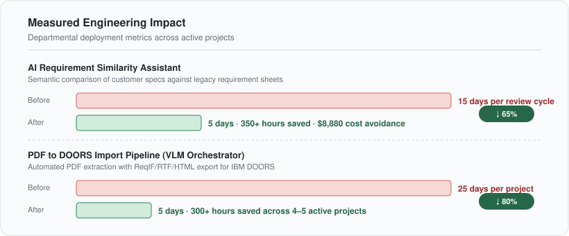
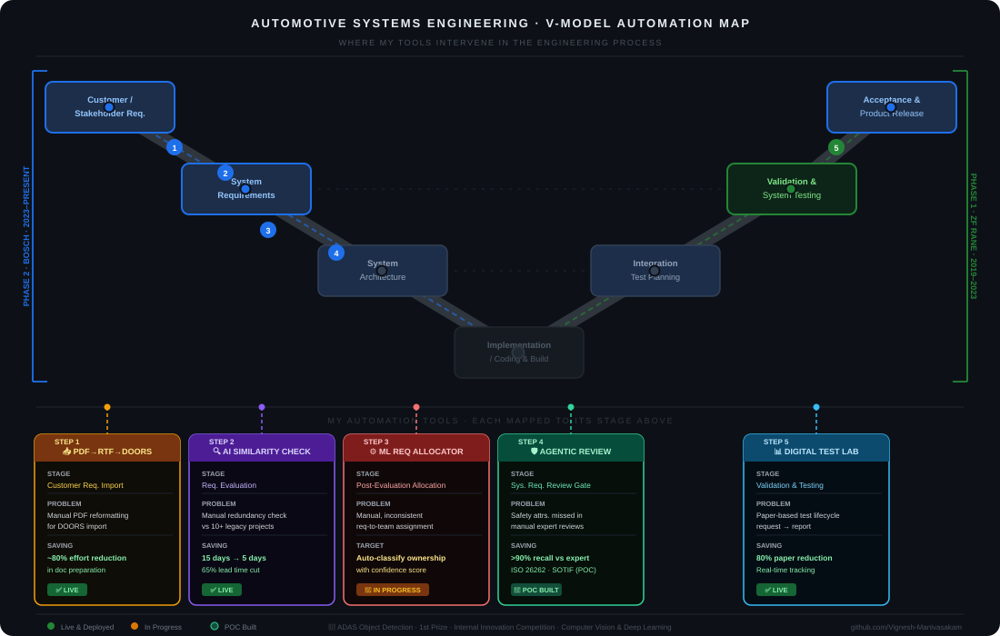

<h1 align="center">👋 Hi, I'm Vignesh Manivasakam</h1>

<h3 align="center">R&D Digitalization Engineer &nbsp;·&nbsp; Automotive AI &nbsp;·&nbsp; GenAI & Agentic Systems</h3>

  
  
  

---

## ⚡ TL;DR — What I Do

> **6+ years in automotive systems engineering (EPS, Steer-by-Wire) × AI/ML — I build production-grade AI tools that eliminate manual bottlenecks inside the automotive V-Model.**
> Currently automating Requirements Engineering @ Bosch. Previously digitalized the full Test & Validation lifecycle @ ZF Rane.

---

## 📊 Measured Engineering Impact

  

| Metric | Result |
|---|---|
| ⏱️ Requirement review lead time | **15 days → 5 days (65% reduction)** |
| 📄 PDF-to-DOORS import lead time | **25 days → 5 days (80% reduction)** across 4–5 active projects |
| 💰 Cost avoidance (3 global OEM programs) | **$8,880 USD + 350+ engineering hours saved** |
| ♻️ NFR specification reusability (10+ projects) | **>80% increase** |
| 📋 Paper-based process reduction | **80% paperless** test operations |
| 🛡️ Safety attribute recall vs. manual expert review | **>90%** |
| 🥇 ADAS Hackathon | **1st Prize — YOLOv8 on Indian Roads** |

---

## 🗺️ The Big Picture — Automating the Automotive V-Model

  

| Phase | Company | Period | Focus |
|---|---|---|---|
| **Phase 2 (Current)** | Bosch | 2023–Present | Requirements Engineering Automation |
| **Phase 1** | ZF Rane | 2019–2023 | Test & Validation Digitalization |

---

## 📦 Project Portfolio

### ⬅️ Phase 2 — Requirements Engineering @ Bosch

---

#### 📥 Step 1 · VLM Orchestrator — PDF to DOORS Import Pipeline

> *"The tool nobody talks about — but every requirements engineer desperately needs."*

| | |
|---|---|
| **Problem** | Importing customer specification PDFs into IBM DOORS required **25 days** of manual reformatting per project — error-prone, repetitive, and blocking every downstream activity |
| **Solution** | Full-stack pipeline: PaddleOCR-VL layout extraction → interactive block editor (React canvas) → concurrent export to three DOORS-compatible formats (**RTF with OLE**, **HTML**, **ReqIF XML**) |
| **Key Engineering** | • **ReqIF 1.1 compliance** — full OMG spec with multi-tool targeting (DOORS Classic 9.x, DOORS Next/ELM, Polarion, Elektrobit) · • **Automatic ReqID discovery** — two-tier system: data-driven family detection by structural fingerprinting + frequency scoring, with meta-pattern regex fallback · • **Three-tier heading inference** — PaddleX model → regex numbering → bbox height heuristic · • **Word COM OLE pooling** — managed COM lifecycle with periodic restart to prevent GDI handle exhaustion · • **OCR result caching** — immutable/mutable JSON split avoids re-running GPU inference on revisits · • **Language filter** — auto-discards non-English blocks, extracts English from mixed content |
| **Impact** | **25 days → 5 days (80% cut)** · **300+ engineering hours saved** across 4–5 active projects — still in development phase |
| **Tech** | `PaddleOCR-VL` `FastAPI` `React/Vite/TypeScript` `ReqIF 1.1` `Word COM (OLE)` `Zustand` |
| **Status** |  · 🔗 [Public POC](https://github.com/Vignesh-Manivasakam/PDF2RTF) |

---

#### 🔍 Step 2 · AI Requirement Similarity Assistant

> *"Stop re-inventing requirements that already exist in your legacy projects."*

| | |
|---|---|
| **Problem** | Engineers manually compared incoming customer requirements against 10+ legacy project specifications — up to 15 days per review cycle, zero consistency |
| **Solution** | ChromaDB-backed semantic search with a **dual-path token saver**: exact string match bypass (zero LLM cost) + embedding search for the rest. Hierarchical section-aware comparison auto-detects document structure, maps sections between specification versions, and performs scoped per-section matching |
| **Key Engineering** | • **5-Gate Self-Improving Prompt Compiler** — (1) statistical error pattern analysis on aggregated feedback, (2) LLM-designed prompt patch, (3) 4-check automated validation (stat backing, contradiction detection, shadow test on holdout set, confidence threshold), (4) human review, (5) canary deployment with deterministic 10% session routing and auto-promote/rollback · • **Level 1 Learning** — feedback recall skips LLM for previously-reviewed pairs (cosine ≥ 0.97 threshold) · • **Per-user skill learning** — extracts matching preferences from corrections, persists in SQLite, injects top-10 rules into prompt |
| **Impact** | **15 days → 5 days (65% cut)** · **$8,880 cost avoidance** · **350+ engineering hours saved** in department deployment |
| **Tech** | `ChromaDB` `NVIDIA NIM` `FAISS` `Streamlit` `OpenAI SDK` `Tenacity` |
| **Status** |  Deployed internally · 🔗 [Public POC](https://github.com/Vignesh-Manivasakam/sentence-similarity-tool) |

---

#### 🧠 Step 3 · Lumina RAG — Multimodal Agentic Enterprise Search

> *"Ask your engineering documents anything — text, tables, drawings, audio, video."*

| | |
|---|---|
| **Problem** | Engineers had no unified way to query across heterogeneous document types (PDFs, drawings, audio meeting notes, video recordings) to verify functional safety requirements |
| **Solution** | Corrective RAG (CRAG) pipeline orchestrated by LangGraph with 5 agents: Router → Retriever → Grader → Rewriter → Generator. Self-correcting loops prevent hallucinations — if retrieved context is irrelevant, the query is automatically rewritten (HyDE, step-back, decomposition strategies) and re-retrieved |
| **Key Engineering** | • **Multimodal ingestion** — PDF/DOCX/PPTX (Docling OCR + table extraction), audio (Groq Whisper-large-v3 transcription), video (ffmpeg keyframe extraction + VLM captioning), images (PyMuPDF + VLM) · • **Hybrid vector search** — Qdrant dense + BM25 sparse with RRF fusion, followed by NVIDIA reranker · • **Content safety** — NVIDIA NemoGuard 8B pre-screens all queries · • **FastMCP server** — exposes document indexing and search as standard Model Context Protocol tools via SSE · • **Inline message editing** — hover to edit any past message; Lumina truncates history at that point and re-streams |
| **Tech** | `LangGraph` `Qdrant` `NVIDIA NIM (Llama 3.2 VLM)` `Supabase` `FastMCP` `Next.js` `Docling` |
| **Status** |  · 🔗 [Repository](https://github.com/Vignesh-Manivasakam/Lumina) |

---

#### ⚙️ Step 4 · PDI Workbench — Platform Design Intelligence

> *"What if I change the torsion bar diameter from 9mm to 10mm? — answered in seconds, not days."*

| | |
|---|---|
| **Problem** | Impact analysis of design changes required consulting multiple disconnected specification documents, knowledge scattered across teams |
| **Solution** | Hybrid agentic pipeline: entity extraction → Neo4j Knowledge Graph multi-tool query (11 tools) → sufficiency check → scoped ChromaDB vector search (4 tools) → Claude Sonnet synthesis with extended thinking. 12 granular SSE event types stream reasoning steps live |
| **Key Engineering** | • **Cytoscape.js** renders Neo4j traversal paths as interactive graph visualizations · • **Plotly.js** projects vector search results as 2D PCA cluster scatter plots · • **Versioned prompt system** — 8 purpose-specific prompts (entity extraction, KG reformulation, sufficiency check, synthesis, self-check) · • **Drawing OCR** — Google Gemini API extracts structured data from engineering drawings with sufficiency scoring |
| **Tech** | `Next.js 14` `FastAPI (SSE)` `Neo4j` `ChromaDB` `Claude Sonnet` `Gemini` `Cytoscape.js` |
| **Status** |  · 🔗 [Repository](https://github.com/Vignesh-Manivasakam/PDI-master) |

---

### ➡️ Phase 1 — Test & Validation @ ZF Rane

---

#### 📊 Step 5 · Digital Test Lab Management System

> *"From paper-based chaos to real-time digital test operations."*

| | |
|---|---|
| **Problem** | The entire test lifecycle — request, scheduling, execution, reporting — ran on paper and spreadsheets |
| **Solution** | End-to-end system: Request → Scheduling → Execution Tracking → Automated Report Generation |
| **Role** | **Project Lead & Process Architect** — defined business logic, system architecture, managed external dev team |
| **Impact** | **80% paperless** · Real-time equipment utilization tracking across the test organization |
| **Tech** | `Process Design` `.NET` `Data Management` |
| **Status** |  Deployed in production |

---

## 🏅 Beyond the Pipeline

---

#### 🚗 ADAS Object Detection & Real-Time Safety Decision Engine

> *"Not just detection — a full driving decision system for Indian mixed traffic."*

- **Layer 1 — Detection**: YOLOv8m trained on IDD dataset with progressive resolution (640→960→1280px) and heavy weather augmentation (rain, fog, sun flare, motion blur)
- **Layer 2 — Inference Engine**: Detection → IoU Tracking → Monocular Distance Estimation → Behavior Classification → 6-Level Safety Decision Hierarchy → Decision Smoothing
- **Key metrics**: mAP@50-95: 0.420 · Precision: 0.773 · F1: 0.655 · INT8 quantized: 3× size reduction, 2× FPS gain
- **🥇 1st Prize** — Internal ADAS Innovation Hackathon
- 🔗 [Full Repository](https://github.com/Vignesh-Manivasakam/ADAS-Object-Detection-Indian-Roads)

---

#### 🎓 Competency Intelligence Platform — Blueprint & Architecture

> *"9-agent AI platform for automated skill profiling, learning path design, and mastery evaluation."*

- 620KB+ of detailed enterprise specifications across 21 documents — infrastructure, database schemas, agent definitions, API contracts, frontend wireframes, CI/CD pipelines
- **9 LangGraph agents**: Competency Architect, Learning State Manager, Assessment Scoring, Content Generator (RAG), Content Reviewer, Learning Path Designer (Dijkstra/A* on Neo4j skill graph), Adaptive Tutor (WebSocket), Mastery Evaluation, Orchestrator
- **4-tier memory**: PostgreSQL (metrics) + Neo4j (skill maps) + Redis (session state) + LangGraph checkpointers
- 🔗 [Specifications Repository](https://github.com/Vignesh-Manivasakam/Competency)

---

#### 🤖 Code Copilot MCP Server

> *"Secure, sandboxed filesystem bridge for AI coding assistants."*

- 10 tier-1 file tools (read, write, search, analyze, find references) with path sandbox security — directory traversal blocking, symlink escape protection, file size governance
- Built on FastMCP v2 + Starlette; auto-encoding detection via chardet; code metrics analysis for 15+ languages
- 🔗 [Repository](https://github.com/Vignesh-Manivasakam/MCP-Code-Copilot)

---

## 🛠️ Tech Stack

  
  
  
  
  
  
  
  
  
  
  
  
  
  
  
  
  
  
  
  
  

---

## 🤝 Let's Connect

**Actively seeking roles in R&D Digitalization · GenAI Systems Engineering · Automotive AI** *(open to relocation)*

If you're building next-gen automotive R&D platforms — let's talk.

  

Built with ❤️ for safer, faster, and smarter automotive engineering

